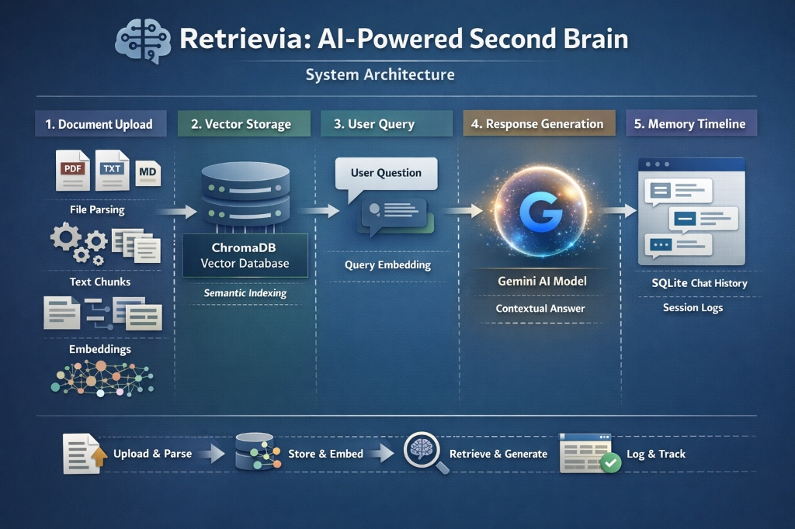

# Retrievia: Your AI Second Brain



Retrievia is a personal knowledge assistant that allows users to upload documents and query them conversationally using Retrieval-Augmented Generation (RAG). It features a beautiful, modern React frontend and a powerful FastAPI backend.

## ✨ Features
- **Upload Documents**: Supports PDF, TXT, and Markdown.
- **Chat & Retrieval**: Ask questions and get answers grounded *only* in the documents you attach to the current session.
- **Memory Timeline**: Automatically tracks your conversation history, allowing you to resume old chats.
- **Document Summarization**: Summarize uploaded documents with a single click.
- **Premium UI**: A polished, responsive, and animated user interface using React, Framer Motion, and Tailwind CSS.

## 🛠 Tech Stack
- **Backend**: FastAPI, Python 3.9+
- **Frontend**: React, Vite, Tailwind CSS, Framer Motion
- **LLM**: Google Gemini API (`gemini-2.5-flash`)
- **Embeddings**: sentence-transformers (`all-MiniLM-L6-v2`)
- **Vector Database**: ChromaDB (persistent local storage)
- **Relational DB**: SQLite (for chat history)

---

## 🚀 Setup Instructions

### 1. Backend Setup

1. **Create and activate a virtual environment**:
   ```bash
   python -m venv venv
   source venv/bin/activate
   ```

2. **Install Dependencies**:
   ```bash
   pip install -r requirements.txt
   ```

3. **Environment Variables**:
   Copy `.env.example` to `.env` and fill in your Gemini API Key:
   ```bash
   cp .env.example .env
   # Edit .env to add your GEMINI_API_KEY
   ```

4. **Start the Backend server**:
   ```bash
   uvicorn backend.main:app --reload --port 8000
   ```
   > Swagger UI for API testing will be available at: [http://localhost:8000/docs](http://localhost:8000/docs)

### 2. Frontend Setup

1. **Navigate to the frontend directory**:
   ```bash
   cd frontend
   ```

2. **Install dependencies**:
   ```bash
   npm install
   ```

3. **Start the React development server**:
   ```bash
   npm run dev
   ```
   > The application will open at: [http://localhost:8501](http://localhost:8501)

---

## 📖 API Documentation (Backend)

- `POST /documents/upload`: Upload a document (PDF, Text, Markdown).
- `POST /chat`: Send a query to chat with an ingested document (supports passing `document_id` for isolated context).
- `POST /summary`: Summarize a specific uploaded document.
- `GET /history`: Get past chat sessions and messages.
- `GET /history/{session_id}`: Load a specific chat session.
